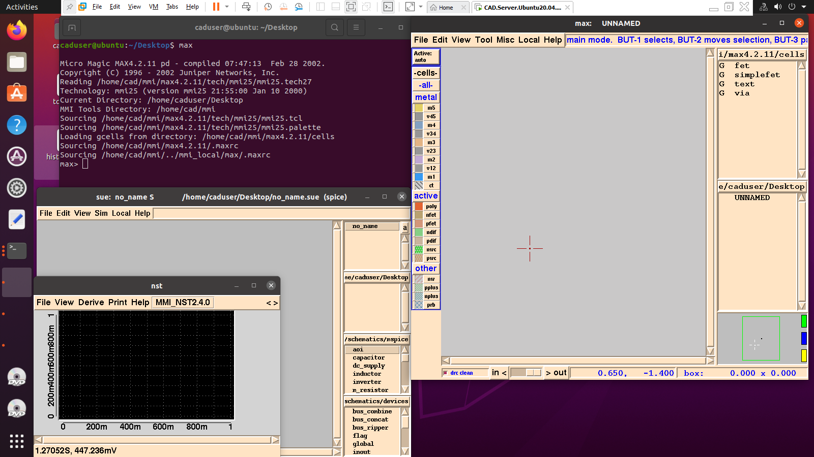
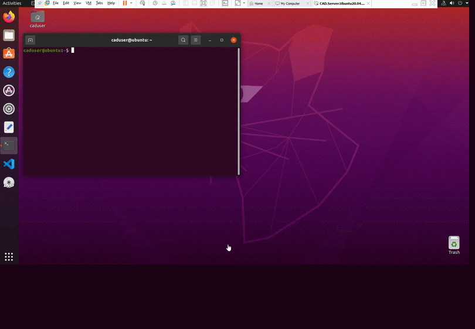
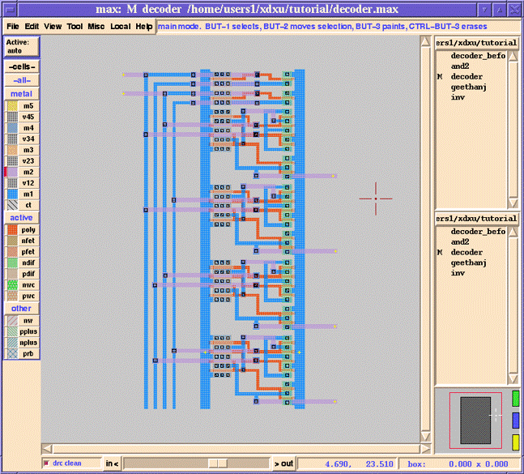

# Revitalizing Public-Domain Version of Micromagic

By [M. B. Ghaznavi-Ghoushchi](https://github.com/ghoushchi).

This is a try to revitalize public-domain version of [Micromagic: mmi_pd](https://sourceforge.net/projects/mmi-pd/) to run in recent 64-bit linux Ubuntu 20.04.4 LTS.

# Introduction
**Micromagic** tool suite is a full IC CAD tool, documentation, scripts, and libraries for designing
high-performance ICs, including SUE for schematics, MAX for
layouts, DPC for datapaths and MCC for megacells.

## 1. Be sure on your Linux distribution
```console
caduser@ubuntu:~$ lsb_release -d
Description:	Ubuntu 20.04.4 LTS
caduser@ubuntu:~$ 
```

## 2. Required settings and installations 
### 2.1 Steps to set your machine to support 32-bit over 64-bit (for Micromagic)
```bash
sudo dpkg --add-architecture i386
sudo apt-get update
sudo apt-get install libc6:i386 libncurses5:i386 libstdc++6:i386
sudo apt-get install multiarch-support
sudo apt-get install libx11-6:i386
sudo apt-get install libc6-i386
sudo apt-get install binutils:i386
sudo apt-get install zsh
sudo apt-get install csh
```
### 2.2 Installing fonts for max/nst 
```bash
sudo apt-get install xfsprogs xfstt
sudo apt-get install t1-xfree86-nonfree
sudo apt-get install ttf-xfree86-nonfree
sudo apt-get install ttf-xfree86-nonfree-syriac
sudo apt-get install xfonts-75dpi
sudo apt-get install xfonts-100dpi
xset +fp /usr/share/fonts/X11/75dpi/
xset +fp /usr/share/fonts/X11/100dpi/
```

### 2.3 Installing xterm for cross-probe between max and sue
```bash
sudo apt-get install xterm
```
## 3. Install Micromagic public-domian 
### 3.1 Download the program and do the following steps

```bash
cd ~
mkdir cad
cd cad
wget https://sourceforge.net/projects/mmi-pd/files/mmi-pd/mmi_pd_040526/mmi_pd_040526.tar.gz
gzip -dc mmi_pd_040526.tar.gz | tar xvf -
ln -s mmi_pd_040526 mmi_pd
cd mmi_pd
ln -s bin.i486-linux bin
cp -r mmi_local.sample ../mmi_local
```
### 3.2 In /etc/bash.bashrc append the following lines. Please change YourUserName to your own
```shellscript
export MMI_TOOLS=/home/YourUserName/cad/mmi_pd
export MMI_BROWSER=firefox
export PATH=$PATH:$MMI_TOOLS/bin
```
## 4. Now test the program
```bash
sue
max
nst
```


Note: If you see problems in max/nst due to fonts (with un-readable fonts or extra font sizes), you must recheck the fonts installation step again with care.





### You will see more about focused usage of this tool with examples... very soon.
### A 2X4 Decoder in micromagic

### Example 1: A 2X4 Decoder in micromagic with very details and steps from my VLSI 2006 PPT #22 


### Credits:
The mmi_pd tool suite is a public-domain version  of [Micromagic](https://www.micromagic.com). All the credits are belong to its originators.

# Related Projects
Please follow us to have informed about related projects


[YARPOSE Project](https://github.com/yarpose) - A Dejavu project in EDA


<p>
  <a href="https://www.linkedin.com/in/ghaznavi-ghoushchi" rel="nofollow noreferrer">
     LinkedIn
  </a> &nbsp; 
  <a href="https://github.com/ghoushchi" rel="nofollow noreferrer">
     Github
  </a>
</p>


